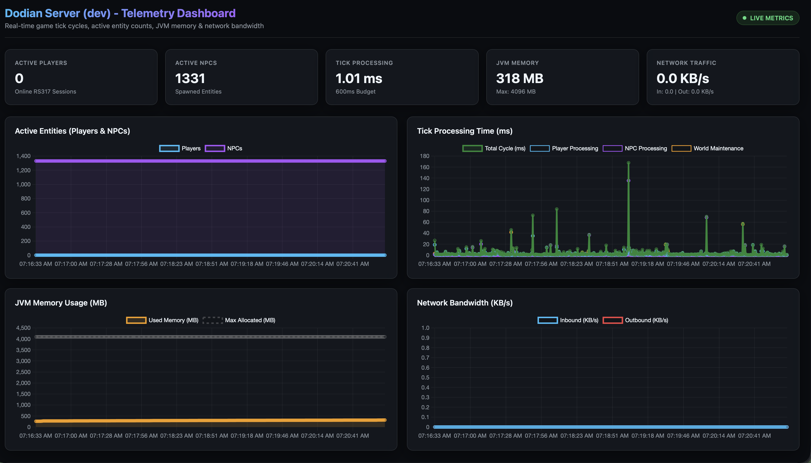
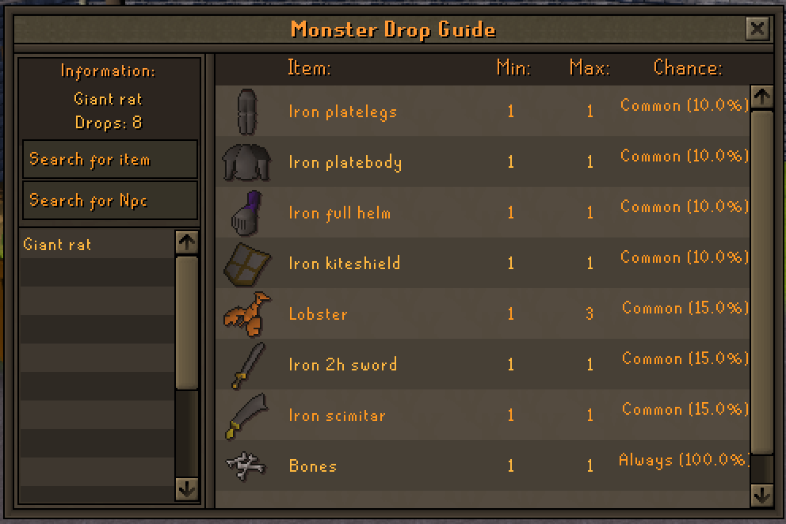
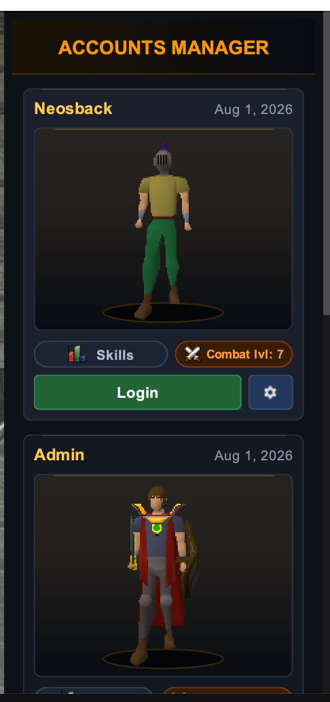
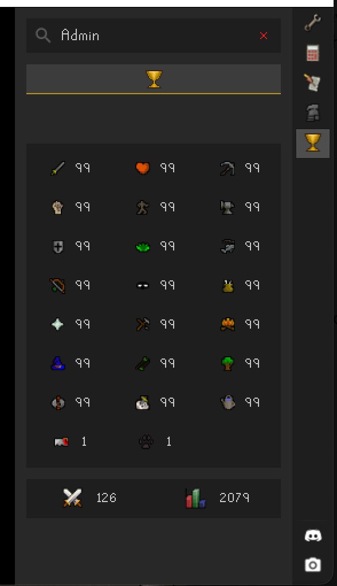

[](https://discord.gg/m4CkqrakHn)

# Dodian Ub3r

This is the original Dodian Ub3r source code, fully modernized into a high-performance modular monorepo.

---

## Major Modernization & Feature Highlights

- **RuneLite Client & Revision 218 OSRS Data (317 Format)**:
  - Upgraded client infrastructure to **RuneLite Client with Revision 218 OSRS Data packed into 317 format** (`main_file_cache.dat`, `.idx0` through `.idx5`).
  - Generated dump-backed cache reference mappings and enriched revision 218 definition metadata (items, objects, NPCs) for accurate ID resolutions across content plugins.
  - Added OSRS "Make-All" interface support (smelting, glassblowing, crafting).

- **Server-Side OSRS Cache Decoding & Spatial Collision Engine**:
  - Implemented direct server-side OSRS cache decoding (`CacheBootstrapService`) that parses map terrain grids, 3D game object bounds (`ObjectDefinitionDecoder`), graphics spot animations (`SpotAnimDefinitionDecoder`), and interface component definitions (`InterfaceDefinitionDecoder`).
  - Automatically streams decoded terrain and object boundaries directly into the RSMod `routefinder` spatial collision matrix across all 35.7M world tiles.

- **Discord OAuth2 Account Creation & Bot Integration**:
  - Implemented secure account registration and authentication via **Discord OAuth2**, eliminating plaintext password transmissions over the game protocol.
  - Integrated Discord bot services for server status tracking and account verification.

- **RSMod-Style Modular Content Plugin System**:
  - Fully migrated all skills out of the monolithic core server code into isolated, decoupled content plugins under `:skills:*` (Agility, Cooking, Crafting, Farming, Firemaking, Fishing, Fletching, Herblore, Mining, Prayer, Runecrafting, Skillguide, Slayer, Smithing, Thieving, Woodcutting) and `:quests:*` (Tutorial Island).
  - Implemented TOML-backed skill guides, declarative plugin descriptors, and event-driven route key bindings so developers can build and extend gameplay features independently.

- **MariaDB Driver Migration & Async Database Handling**:
  - Replaced legacy database connectors with the modern **MariaDB JDBC Driver (`org.mariadb.jdbc:mariadb-java-client`)** utilizing `jdbc:mariadb://` connections (compatible with MariaDB and MySQL server instances).
  - Modernized connection management with **HikariCP** pooling and Virtual Thread async dispatchers (`DbDispatchers`).

- **JDK 21 & Kotlin 2.3 Runtime Modernization**:
  - `game-server` builds and runs natively on **JDK 21** with **Kotlin 2.3** (`jvmTarget = "21"`).
  - Configured **Generational ZGC** (`-XX:+UseZGC -XX:+ZGenerational`), String Deduplication (`-XX:+UseStringDeduplication`), and memory footprint optimizations (reducing startup heap usage down to **~300MB**).
  - Leveraged JDK 21 **Virtual Threads** (`Thread.ofVirtual()`) for async database operations and parallel startup data loading (`NpcManager`, `ItemManager`, `CacheBootstrapService`).

- **RSProt-Style Networking & FIFO Packet Pipeline**:
  - Upgraded networking layer to a Netty-based **RSProt-style architecture** supporting Linux Epoll transport, zero-allocation packet parsing, and strict First-In-First-Out (FIFO) packet execution.

- **RSMod Pathfinding & Spatial Engine**:
  - Integrated RSMod pathfinding engine (`routefinder`) with real-time object collision overlays and spatial chunk indexing (`Chunk`) for precise entity movement and region synchronization.

- **Atomic Economy & Anti-Dupe Safeguards**:
  - Wrapped duel payouts, stake refunds, and banking operations into atomic transactions (`EconomyTransaction.run{}`), eliminating item duplication exploits and race conditions.

- **Developer Experience & Diagnostic Logging**:
  - Added real-time operational monitoring endpoints: **Prometheus Text Exporter** (`http://localhost:8081/prometheus`) and **Interactive Visual Dashboard** (`http://localhost:8081/dashboard`).
  - Added structured ASCII Service Table boot output, condensed diagnostic metrics, and clean Gradle dev builds.

---

## Quick Setup & Cache Setup Guide

1. **Prerequisites**: Host OS with **JDK 21 or greater** (Gradle auto-provisions JDK 21 per machine).
2. **Database**: MariaDB 10.11+ or MySQL 8.0+ instance running with `.env` configured (`SERVER_DATABASE_INITIALIZE=true`).
3. **OSRS Cache Setup (317 Format)**:
   - Download the **Revision 218 Cache (OSRS Data packed into 317 Format)**: [cache-tarnish-218.zip](https://files.jire.org/cache-tarnish-218.zip)
   - Extract the contents into `game-server/data/cache`.
   - **Important**: If the ZIP extracts as a folder named `cache-tarnish-218`, rename it to `cache` so that the cache index files reside directly inside:
     ```
     game-server/data/cache/
     ```
   - **Expected Server Cache Files in `game-server/data/cache`**:
     - `main_file_cache.dat`
     - `main_file_cache.idx0`
     - `main_file_cache.idx1`
     - `main_file_cache.idx2`
     - `main_file_cache.idx3`
     - `main_file_cache.idx4`
     - `main_file_cache.idx5`
4. **Run Server**: `./gradlew :game-server:run`

---

## Active Work in Progress

- **Map Editing & Custom Map Support**:  
  Map editing with custom maps (WIP) — ongoing work on pipeline support for loading, editing, and rendering custom 317 map files and collision overlays.

- **Following & Movement Refinements**:  
  Continuously tuning RSMod pathfinder following logic and collision handling to eliminate edge-case pathing quirks.

- **Farming Skill Expansion**:  
  Expanding farming patch states, crop growth cycles, and plugin-owned farming handlers.

- **NPC AI & Movement Mechanics**:  
  Modernizing legacy NPC combat AI, pathing boundaries, and movement behaviors.

---

## Long-Term Direction

The long-term goal is to continue modularizing the codebase, reducing main-thread tick workloads, expanding RSMod-style plugin content, and maintaining a state-of-the-art RSPS architecture powered by modern JVM and Kotlin standards.

---

## Previews & System Screenshots

| RuneLite Client 317 | Real-Time Visual Telemetry Dashboard |
| :---: | :---: |
|  |  |

| In-Game Monster Drop Guide | Accounts Manager | RuneLite Hiscores Integration |
| :---: | :---: | :---: |
|  |  |  |

---

[Click here](/docs) to find more information about how to set up, host, or otherwise use this project.

---

## Feedback and Bug Reports

Suggestions, improvements, or bug reports can be submitted on [GitHub Issues](https://github.com/dodian-community/ub3r-monorepo/issues)

Or on Discord under [Bug Reports](https://discord.com/channels/833648712633810974/1137413395277164615)